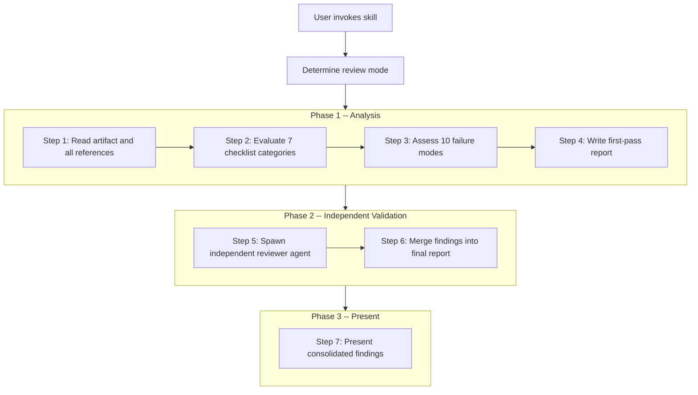

# cursor-skill-security-review

A [Cursor](https://cursor.com) AI agent skill that performs structured security reviews of automation skills, deployment plans, and live setups. It finds real risks — credential exposure, injection vectors, blast radius gaps, failure cascading — instead of rubber-stamping automation as "looks fine."

The skill adopts the mindset of a senior cybersecurity analyst: it assumes the artifact under review will eventually be used under adversarial conditions, operated by a tired human against the wrong environment, and left in an inconsistent state by a partial failure. It finds these failure paths before they happen.

## How It Works

The skill runs a **dual-pass review** — a first-pass analysis followed by an independent second-pass validation from a separate AI agent with no prior context. This catches blind spots that a single reviewer would miss.



The independent second-pass agent reads the artifact fresh, validates checklist coverage, identifies missed issues, checks remediation quality, and flags disagreements with the first pass. Severity disagreements are resolved by taking the higher severity.

## Review Modes

| Mode | When to Use | Input |
|------|-------------|-------|
| **Skill Review** | Reviewing a Cursor agent skill | Path to a `SKILL.md` or skill directory |
| **Deployment Plan Review** | Auditing an infrastructure or deployment plan | Path to a plan/setup markdown file |
| **Post-Deployment Audit** | Checking a live system's configuration | Config output, setup description, or running config |

The skill auto-detects the mode based on the path or description you provide.

## What Gets Checked

### 7 Checklist Categories (35+ individual checks)

Each check has a defined severity level and detailed evaluation criteria. The full checklist is in [`references/review-checklist.md`](references/review-checklist.md).

| # | Category | What It Covers |
|---|----------|----------------|
| 1 | **Credential Hygiene** | API keys in shell commands, secrets in temp files, `.env` permissions, hardcoded credentials, credentials in error output |
| 2 | **Write Operation Safety** | Missing dry-run, no confirmation gates, unbounded bulk operations, no rollback path, missing idempotency |
| 3 | **Data Boundary Enforcement** | Sensitive data in LLM context, PII in case descriptions, raw alert data retention, secrets in agent transcripts |
| 4 | **Blast Radius Controls** | Wildcard index patterns, untrusted ID lists, missing environment guards, no scope caps, unbounded time windows |
| 5 | **Failure Cascading** | Acknowledged alerts with no case, orphaned cases, no cleanup on failure, retry without deduplication, silent failures |
| 6 | **Input Validation and Injection** | Shell command injection via alert fields, query injection, prompt injection, markdown injection, path traversal |
| 7 | **Operational Resilience** | Rate limiting, timeout handling, error message leaking internals, health checks, dependency assumptions |

### 10 Common Failure Modes

Structural patterns that create systemic risk over time. These go beyond individual checks — they evaluate how the system behaves at scale, under adversarial conditions, and over time. The full guide is in [`references/common-failure-modes.md`](references/common-failure-modes.md).

| # | Failure Mode | Core Risk |
|---|-------------|-----------|
| 1 | Alert fatigue amplification | Auto-creating cases for every finding erodes analyst trust |
| 2 | Automation without circuit breakers | Bulk operations with no upper bound |
| 3 | Implicit trust in LLM output | Acting on AI classifications without human verification |
| 4 | Security theater | Checks that look thorough but miss the actual attack surface |
| 5 | Credential sprawl | Accumulating broad API keys with no rotation or scoping |
| 6 | Log poisoning and prompt injection | Attacker-controlled data flowing into LLM prompts or shell commands |
| 7 | Orphaned state | Partial completion leaving the system inconsistent with no record |
| 8 | Blast radius ignorance | Not understanding what happens when operations affect 100x expected records |
| 9 | Drift between docs and implementation | Safety measures documented but not enforced in code |
| 10 | Insufficient audit trail | Automated actions with no persistent record of what was done |

## Severity Levels

| Level | Criteria | Examples |
|-------|----------|---------|
| **CRITICAL** | Exploitable in practice, data loss or unauthorized access likely | Command injection via alert fields, API keys in logs, bulk operations with no cap |
| **HIGH** | Significant risk under realistic conditions | Missing confirmation gates, partial failure state, query injection |
| **MEDIUM** | Notable concern that should be addressed | Excessive data in LLM context, missing timeout handling, PII in cases |
| **LOW** | Minor improvement, defense in depth | Missing health checks, no progress indicators, documentation gaps |

When in doubt, the skill uses the higher severity. It is better to over-flag and let you downgrade than to miss a real issue.

## Installation

### Global (available to all projects)

Copy the skill directory to your global Cursor skills folder:

```bash
git clone https://github.com/davethegut/cursor-skill-security-review.git
cp -r cursor-skill-security-review ~/.cursor/skills/skill-security-review
```

### Project-level (available to one project)

Copy into your project's `.cursor/skills/` directory:

```bash
git clone https://github.com/davethegut/cursor-skill-security-review.git
cp -r cursor-skill-security-review /path/to/your/project/.cursor/skills/skill-security-review
```

### Verify installation

The skill should appear in Cursor's skill list. You can confirm by checking that `SKILL.md` is readable at the installed path and that the `references/` directory contains the three reference files.

## Usage

Attach the skill in a Cursor chat by referencing it with `@skill-security-review`, then point it at the artifact you want reviewed.

### Skill Review

```
@skill-security-review Review the skill at skills/my-automation/SKILL.md
```

### Deployment Plan Review

```
@skill-security-review Review the deployment plan at docs/infrastructure-plan.md
```

### Post-Deployment Audit

```
@skill-security-review Audit the current Kibana security setup based on this config: [paste config]
```

### What to Expect

1. The skill reads the target artifact and all files it references (scripts, configs, `.env` patterns)
2. It evaluates against all 7 checklist categories and 10 failure modes
3. It writes a first-pass report to `work_docs/reviews/security-review-{name}-{date}.md`
4. It spawns an independent reviewer agent that re-reads the artifact from scratch
5. The second-pass findings are merged into the final report
6. You receive a summary with overall risk level, top findings, and prioritized remediations

## Output Format

Reviews are written as structured markdown reports. The template is in [`references/review-template.md`](references/review-template.md). Each report includes:

- **Risk Summary** — overall risk level, counts of findings by severity, write operations identified, credential exposure points
- **First-Pass Findings** — each finding with checklist reference, file location, description, risk assessment, and actionable remediation
- **Failure Mode Assessment** — table evaluating all 10 structural failure patterns (Yes / Partial / No)
- **Second-Pass Review** — independent agent's coverage validation, additional findings, remediation validation, and disagreements
- **Consolidated Recommendations** — priority-ordered action items merging both passes

See [`examples/sample-review-output.md`](examples/sample-review-output.md) for a real review report.

## Customization

The skill's knowledge is fully contained in editable markdown files. You can extend it without modifying `SKILL.md`.

### Adding checklist items

Edit [`references/review-checklist.md`](references/review-checklist.md). Add new checks to an existing category or create a new category (category 8+). Follow the existing format:

```markdown
| 8.1 | Your new check description | SEVERITY | Detailed evaluation criteria |
```

### Adding failure modes

Edit [`references/common-failure-modes.md`](references/common-failure-modes.md). Add a new numbered section following the existing pattern (title, "Pattern", "Why it fails", "What to check", "Good pattern").

### Modifying the report template

Edit [`references/review-template.md`](references/review-template.md) to change the output structure. The skill reads this template at runtime, so changes take effect immediately.

### Adjusting severity thresholds

The severity guidelines in `SKILL.md` can be adjusted to match your organization's risk tolerance. The "when in doubt, use the higher severity" default can be changed to match your preferred approach.

## Limitations

- **Does not fix issues.** It identifies and documents them with remediations. You decide what to act on.
- **Does not run scripts or commands against live systems.** The review is entirely read-only analysis.
- **Does not validate that scripts actually work.** It evaluates whether their *design* is secure, not whether they execute correctly.
- **Does not replace a formal penetration test or security audit.** This is a design-time review tool, not a runtime security scanner.

## Repository Structure

```
├── SKILL.md                          # Main skill definition — workflow, modes, severity guidelines
├── references/
│   ├── review-checklist.md           # 7 categories, 35+ security checks with severity levels
│   ├── common-failure-modes.md       # 10 structural failure patterns
│   └── review-template.md           # Standardized report output template
└── examples/
    └── sample-review-output.md       # Real review report from an attack-discovery triage skill
```

## License

[MIT](LICENSE)
